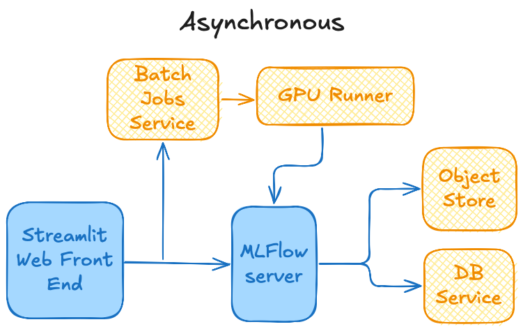
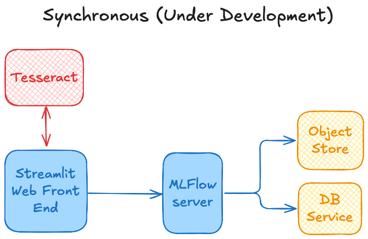

# TSADAR GUI

This repository holds the user-facing pieces of TSADAR, an open-source Thomson
Scattering data analysis package:

- **`tsadar_browser/`** — backend for the analysis browser and visualizer: a
  read-only FastAPI layer over the MLflow tracking server. See
  [docs/browser.md](docs/browser.md).
- **`frontend/`** — the browser itself: a Vite + React + TypeScript SPA whose API
  client is generated from the backend's OpenAPI schema. See
  [frontend/README.md](frontend/README.md).

  Tracking issue: [#37](https://github.com/ergodicio/tsadar-app/issues/37).
- **`tsadar_app.py` / `tsadar_gui/`** — the older Streamlit app (below). Note its
  job-submission path targets retired infrastructure and the app is no longer
  deployed; see [#35](https://github.com/ergodicio/tsadar-app/issues/35).
- **`tesseract/`** — a [Tesseract](https://github.com/pasteurlabs/tesseract-core)
  wrapping TSADAR's differentiable forward model (spectrum + Jacobian).

## Streamlit app

This is a streamlit app for TSADAR, an open-source Thomson Scattering data analysis package. 

To run this app, install the requirements and then run

`USERNAMES="yourname,othernames" streamlit run tsadar_app.py`

and you should be able to view the app in a browser

### Cloud Architecture
This app can be, and is deployed to the public cloud. This enables the user to run Thomson Scattering analysis remotely, and either asynchronously and synchronously (under development)

The Asynchronous architecture submits a job to AWS Batch for the entire analysis and returns the result

The Synchronous architecture uses a TSADAR [Tesseract](https://github.com/pasteurlabs/tesseract-core) for the spectrum and gradient calculation and enables the user to interact with the data and the fit

